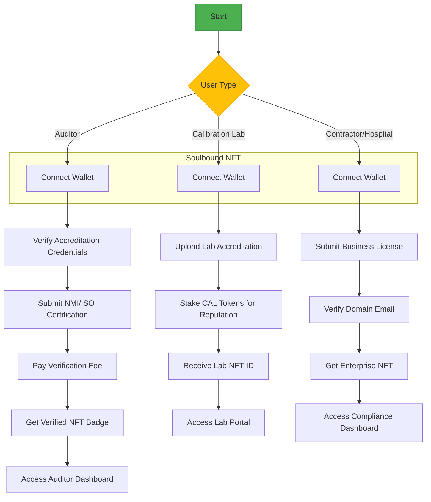

# slides

[editable slides](https://gamma.app/docs/Calibra-Revolutionizing-Calibration-qcghjofjhh9alrm)

---

## pitch deck

[pdf](./Calibra-Revolutionizing-Calibration.pdf)

[deck](./deck.md)

[TAM SAM SOM](./TAM-SAM-SOM.md)

[what is TAM SAM SOM?](./TSS.md)

## actor flow

## live website

[demo](https://calibra-client.vercel.app/)
